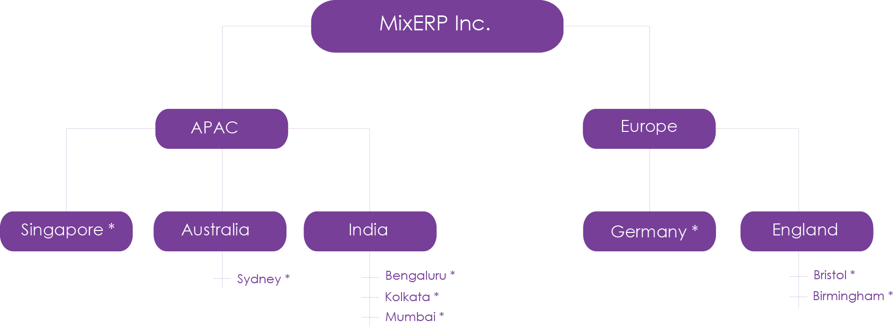

#MixERP User Documentation

MixERP aims on being an efficient and cost-effective ERP solution. Before you proceed to the following chapters, you may want to take a quick note on the following topics:

##MixERP Is Desiged for Multi-Establishment

MixERP is a multi-establishment ERP software which facilitates you to run **any number of office** in a **centralized environment**. This means that if you have multiple branch offices of the same establishment, you **should not create** 
multiple companies (and databases) and host separate application for each branch. 
You **should**, instead, create a hierarchical office structure as shown in the image.

* transaction units.

###Remember
* Chart of Accounts is establishment-neutral. The Accounts (GL Heads) are common to all offices.
* Parties (Customers or Suppliers) are also establishment-neutral and common to all offices.
* A GL Head can have different closing balance on different offices.
* A GL Head balance when viewed on a parent office means the sum of all child offices.
* A party has a payable or receivable balance according to office.
  A party balance when viewed on a parent office means the sum of all child offices.
* A stock item has an inventory balance according to office.
  A stock item balance when viewed on parent office means the sum of all child offices.
* You cannot post transactions to an office group (an office which has child offices).
* You can create General Ledgers (Accounts), Stock Items, Parties when logged in to any office.
  Remember these entities are global--shared by all offices. 

##Core Concepts
- [Date Expressions](date-expressions)
- [Understanding MixERP Menu](understanding-menu)
- [Understanding and Configuring Taxes](understanding-and-configuring-taxes)
- [Flags](flags)
- [Transaction Governor](transaction-governor)
 - [Transaction Posting Engine](transaction-posting-engine)
 - [Policy Engine](policy-engine)
- [End of Day Operations](eod-operations)
- [Widgets](widgets)

## Introduction
 - [Account Management](account-management)
  - [User Profile Management](profile-management)
  - [Change Password](change-password)

##Modules
- [Sales](sales)
- [Purchase](purchase)
- [Inventory](inventory)
- [Finance](finance)
- [Production](production)
- [Customer Relationship Management](crm)
- [Back Office](back-office)
- [Point of Sales](point-of-sales)

##Related Topics
* [MixERP Documentation](../documentation/main)
* [Technical Documentation](technical-documentation)